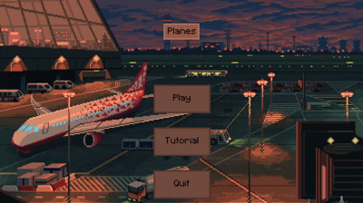
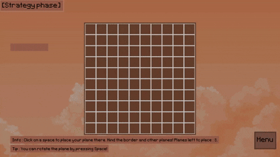
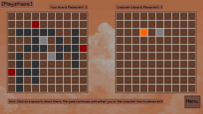

# 🛩️ Planes Game

## 🎉 Introduction

Welcome to **Planes**! It is a strategy-based guessing game inspired by *Battleship*, but with a thrilling twist!
Instead of sinking ships, your mission is to locate and shoot down **three hidden planes** on a 10×10 grid.
The catch? A plane can only be destroyed by hitting its **head/cockpit**.

This game is very close to my heart since I used to play it on paper with my classmates back in elementary school, making guesses and sketching planes during breaks. My parents also played it when they were young and enjoyed it just as much.
Recreating it as a full-fledged Python game was not only a fun challenge, but also a nostalgic trip back to those moments.

This project was developed in **Python** as my final homework for the **Fundamentals of Programming** course during my **first year of university**.

  
*Smooth and simple navigation before the strategic battle begins!*

---

## 🧠 AI Opponent

The game features an **intelligent AI** powered by a custom algorithm I designed, inspired by the **probability density function** used in smart Battleship AIs.

Unlike random guessing, this AI:

* 📊 Calculates the most probable locations of your planes.
* 🎯 Adjusts its guesses based on previous hits and misses.
* 🔄 Learns and improves efficiency during the match.

This makes it a **challenging and adaptive opponent** for players of all skill levels.

---

## 🌟 Features & Gameplay Highlights

* 🗺️ **Strategy Phase** - Place your planes anywhere on the board and rotate them with the **spacebar** to outwit the AI.  
  


* 🎯 **Play Phase** - Take turns with the smart AI to guess your opponent’s plane locations. Hit the cockpit to destroy a plane!  
  


* 🧠 **Smart AI Opponent** – Uses a probability-based targeting system instead of random guessing, making the challenge more engaging.


* 🎮 **Turn-Based Gameplay** – Fair play with alternating turns between you and the AI.


* 📊 **Dynamic Difficulty** – The AI adapts based on your moves and accuracy, keeping the challenge balanced.

---

## 🏆 Challenges & Learnings

The **most challenging part** of developing this game was designing the **smart AI**.
I researched how probability density functions are used in advanced Battleship AIs and then adapted those ideas to fit the unique rules of Planes.
The result is my **own original algorithm**, custom-built for this game.

Through this process, I:

* 🔍 Learned how to analyze and adapt an existing algorithm to a new problem.
* 💡 Practiced breaking down complex logic into smaller, testable components.
* 🐍 Improved my Python development skills, especially in structuring a project and handling game states.
* 🎯 Gained experience in balancing AI difficulty to make it fun yet competitive.

This was both a **technical challenge** and a **great learning experience**.

---

## ⚙️ Requirements

* Python **3.x**
* `pip` for installing dependencies

---

## 🚀 Installation

1. **Clone the repository**:

   ```bash
   git clone https://github.com/dosqas/planes.git
   cd planes
   ```

2. **Check your Python version**:

   ```bash
   python --version
   ```

3. **Install dependencies**:

   ```bash
   pip install -r requirements.txt
   ```

---

## ▶️ Running the Game

```bash
python -m src.main
```

---

## Acknowledgements

* Thanks to the creators of the images used in this game. 
* Special thanks to the **Pygame** community for the fantastic library that made game development enjoyable and accessible.

---

## 📄 License

This project is licensed under the MIT License. See the [LICENSE](LICENSE) file for details.

---

## 💡 Contact

Questions, feedback, or ideas? Reach out anytime at [sebastian.soptelea@proton.me](mailto:sebastian.soptelea@proton.me).
